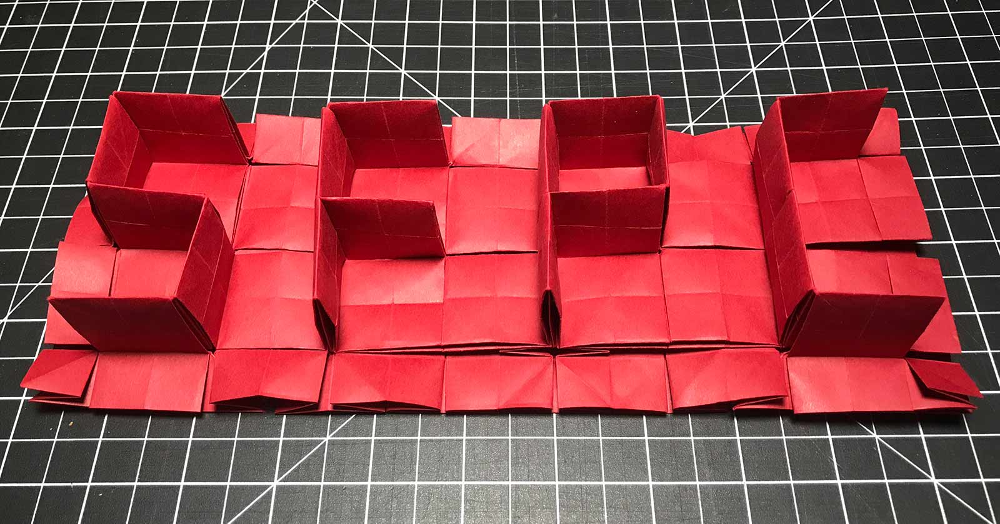

# Code-Paper-Scissors

### February, 2019 at the School for Poetic Computation

- 2 Week Session, Monday Feb 4th - Sunday Feb 17th
- @ SFPC, 155 Bank street, West Village, NYC
- 6:30pm - 9:30pm, Monday to Friday

# Teachers

- Kelli Anderson
- Simon Arizpe
- Coralie Gourguechon
- Robby Kraft
- Pam Liou

# Classes

## Introduction

*Robby, Kelli, Coralie, and Taeyoon Choi*

> Feb 4

Taeyoon will welcome everyone to SFPC. Three Code-Paper-Scissors instructors will introduce the three main tracks:
- Robby: origami, math history, software
- Coralie: paper electronics
- Kelli: function from structure

We'll spend time getting to know our fellow students, the space, tools, and finish the evening with our first origami activity and an introduction to crease patterns.

## Foundation Skill-Building: Paper Engineering

*Kelli*

> Feb 5, 13

## Pop-up Mechanisms

*Simon Arizpe*

> Feb 6

## Origami Design 1: Flat-foldability and uniaxial bases

*Robby*

> Feb 7

[syllabus](https://paper.dropbox.com/doc/Origami-Design-1--AWnpyO25FCHwsHAJjaT94rbkAQ-8igCiI3wEzS3887lUpEiA)

This class is part-studio, part-lecture, hands-on workshop covering 3 approaches to origami design: 

- modifying existing designs
- free-form design by concave-hull wrapping
- circle river uniaxial-bases

The lecture component of the class is meant to introduce concepts in as brief time as necessary leading into the more important part: the hands-on exploration of the concept. The class oscillates between these two states frequently. Though maybe not explicitly discussed, the secondary aim of the class is to introduce students to developing an artistic intuition, and what can only be described as an origami intuition: how to optimize use of material and to weigh decisions when approaching a fork in the road to best prevent a dead-end.

Sources:

- [Robert Lang - Origami Design Secrets](https://www.amazon.com/Origami-Design-Secrets-Mathematical-Methods/dp/1568814364/)
- [Erik Demaine, Joseph O'Rourke - Geometric Folding Algorithms](https://www.amazon.com/Geometric-Folding-Algorithms-Linkages-Polyhedra/dp/0521857570)

## Paper Electronics
*Coralie Gourguechon, Pam Liou*

> Feb 8, 12

## Origami Design 2: tessellations, rigid folding, software

*Robby*

> Feb 11

This class will be covered in three parts. The first section is all about the hard parts of origami, beginning with what might be the frontiers of origami: curved creases and crumpling. We'll discuss what makes this hard and and why there are unsolved problems. Discuss what *is* easily solvable leads us into origami software and we'll take a look under the hood of Rabbit Ear. Again, we'll look at some difficult problems in origami software and what makes them hard. We'll end this section with a demonstration of how to create a crease pattern in code and render it in Origami Simulator.

The second component begins with an introduction to origami tessellations, followed by a workshop where we create our own tiling. Students will be able to prototype a design and perform their own foldability tests.

The final component is an introduction to rigid folding and a look at software by Tomohiro Tachi: Freeform Origami, and Origamizer. We'll look at the "algorithm that can make anything" (Tachi, Demaine), and an exercise in a collapsable cardboard creation.

Sources:

- [Robert Lang - Twists, Tilings, and Tessellations](https://www.amazon.com/Twists-Tilings-Tessellations-Mathematical-Geometric/dp/1568812329/)
- [Tachi, Demaine - Origamizier Algorithm](https://pdfs.semanticscholar.org/758b/3b9cea1b8391a73ff68846011c7f480fe7a0.pdf)

## Designing for the grain of things

*Kelli*

> Feb 14

---

**header image was designed using the [orthogonal maze algorithm by Erik Demaine, Martin Demaine, Jason Ku](http://erikdemaine.org/fonts/maze/?text=SFPC)**